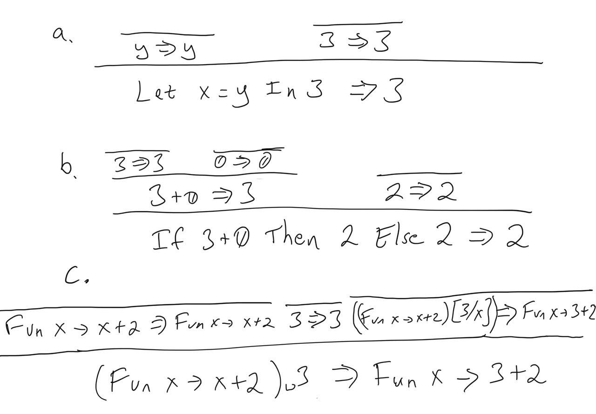

## Assignment 3: Operational Semantics

This is a short homework giving you some practice with operational semantics before starting on writing your Fb interpreter. Please consult [Chapter 2 of the book](https://pl.cs.jhu.edu/pl/book/book.pdf) for the full details on various definitions, and for more examples beyond those in lecture, if you have any questions.

1.  [5 points] Compute the following substitutions. Note that we informally defined subsitution in lecture, and the precise substitution function is defined in Section 2.3.2 of the book. Make sure to classify each variable as bound or free to make sure you are performing the correct substitution.

    a.  `(Fun x -> Fun z -> (x + y) = z) [4/y]`

    b.  `(If z Then (Fun x -> Fun z -> x And z) Else 22) [True/z]`

    c.  `(Fun x -> y - z + 1) [3/x]`

    d.  `((Fun f -> Fun x -> f x) (Fun y -> x)) [2/x]`

    e.  `(Let y = x + 1 In y + 2) [5/y]`

    f.  `(Let f = f In f f) [(Fun f -> f)/f]`

2. [9 points] The following flawed proof trees are not theorems.  Describe why the proof tree is not valid (i.e. why the last line is in fact not a theorem).

    

3.  [15 points] Write operational semantics proofs (i.e., proof trees) showing what the following expressions evaluate to in the Fb operational semantics. Please give the whole proof trees, using the rules in Chapter 2.  You may reference one proof tree in another like a "proof tree macro" to make your answer more readable if you want (in other words, you can re-use any one proof tree in another, just like how proofs of Lemmas can be used in Theorems in math).  Note it is not a bad idea to start by running them in the reference interpreter to make sure you are on the right path.

    a.  `Let f = (Fun y -> Not y) In Fun z -> If (f z) Then 1 Else 0`

    b.  `(Fun f -> Fun z -> If (f z) Then 1 Else 0) (Fun y -> Not y) False`

    c.  `Not((Fun x -> If x = 0 Then True Else Fun x -> x) 0)`

4.  [10 points] In languages like C or Java, binary boolean operators are "short circuiting" - i.e. For an expression like `file != null && file.length() > 0`, the second expression is evaluated only if the first expression is true. Similarly for `||` operations, the second expression is evaluated only if the first expression evaluates to false. This is not true in the default Fb operational semantics. 
    
    a. Modify the operational semantics of Fb `And` and `Or` such that they perform short-circuiting.

    b. One consequence of changing the operational semantics of a language is that it might affect what proofs  `e => v` can be constructed in this language. Can you think of an expression `e` that will compute to a value `v` in your short-circuited version of `Fb`, but cannot compute to any value in `Fb`? What about the other way around?

### Submission and Grading

Upload your homework pdf to Gradescope. As long as you can make a pdf and we can read it, the format is fine.  So, scans of your handwritten solution are fine as long as they are readable and are in pdf format.  Please do verify the scans are **readable** before uploading!

Please remember to list any collaborators at the top of your submission as was done in assignments 1 and 2.