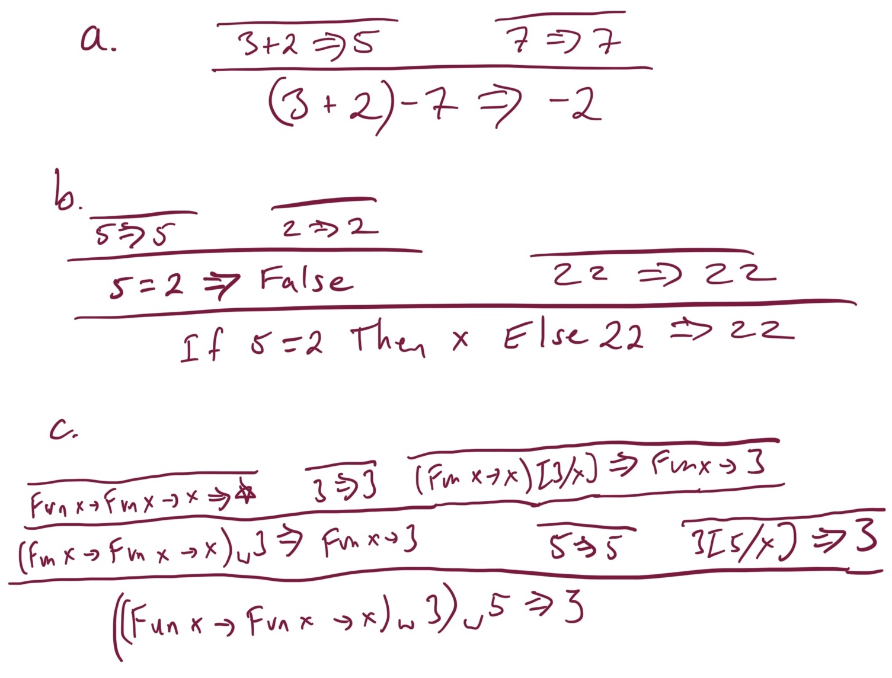

## Assignment 3: Operational Semantics

This is a short homework giving you some practice with operational semantics before starting on writing your Fb interpreter. Please consult [Chapter 2 of the book](http://pl.cs.jhu.edu/pl/book/book.pdf) for the full details on various definitions, and for more examples beyond those in lecture, if you have any questions.

1.  [5 points] Compute the following substitutions. Note that we informally defined subsitution in lecture, and the precise substitution function is defined in Section 2.3.2 of the book.

    a.  `(Fun x -> z + 1) [3/x]`

    b.  `(If z Then (Fun z -> Fun y -> y And z) Else 22) [True/z]`

    c.  `(Fun x -> Fun z -> x And y) [4/y]`

    d.  `((Fun x -> x) (Fun y -> x)) [2/x]`

    e.  `(Let y = x + 1 In y + 2) [5/y]`

    f.  `(Let f = f In f f) [(Fun f -> f)/f]`

2. [9 points] The following Fb proof trees are not theorems.  Describe why the proof tree is not valid (i.e. why the last line is in fact not a theorem).  Note the star here is used like in the book, it means the expression on the left computes to itself.

    

3.  [15 points] Write operational semantics proofs (i.e., proof trees) showing what the following expressions evaluate to in the Fb operational semantics. Please give the whole proof trees, using the rules in Chapter 2.  You may reference one proof tree in another like a "proof tree macro" to make your answer more readable if you want (in other words, you can re-use any one proof tree in another, just like how proofs of Lemmas can be used in Theorems in math).  Note it is not a bad idea to start by running them in the reference interpreter to make sure you are on the right path.

    a.  `Let f = (Fun y -> y + 1) In Fun z -> (f z) + 1`

    b.  `(Fun f -> Fun z -> (f z) + 1) (Fun y -> y + 1) 4`

    c.  `(Fun x -> (If x = 2 Then Fun x -> x Else 1)) 2 4`

4.  [10 points] Fb currently lacks string data.  For this question we are going to define a new language **FbSt** which adds string constants such as `"blahblah"` and the infix `^` string append operation to Fb, and also extends the infix `=` to work on string data.

    a. Define the BNF for **FbSt**.  Note you can write "... Fb's ..." to indicate a copy/paste of the Fb clauses.

    b. Write new proof rules, in the spirit of the existing rules.  You can also say "... Fb's ..." to paste in the Fb rules as part of your set.

### Submission and Grading

Upload your homework pdf to Gradescope. As long as you can make a pdf and we can read it, the format is fine.  So, scans of your handwritten solution are fine as long as they are readable and are in pdf format.  Please do verify the scans are readable before uploading!