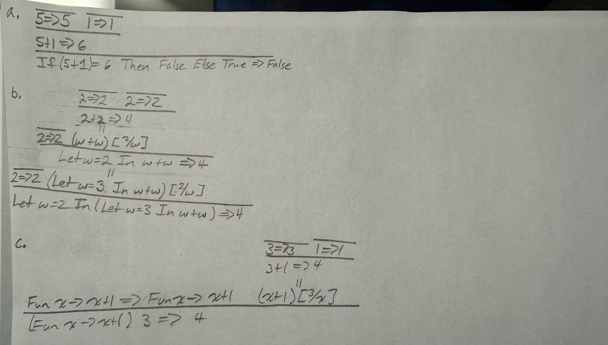

## Assignment 3: Operational Semantics

This short homework assignment will give you some practice with operational semantics before starting to write your F&#9837; interpreter. Please consult [Chapter 2 of the book](http://pl.cs.jhu.edu/pl/book/book.pdf) for the full details on various definitions and for more examples beyond those in the lecture if you have any questions.

1.  [5 points] Compute the following **substitutions**. Note that the substitution function is defined formally in Section 2.3.2 of the book.

    a.  `(Fun y -> x + 1) [12/x]`

    b.  `(Fun z -> Fun z -> 5 + z) [6/z]`

    c.  `(Fun x -> Fun z -> x And y) [True/y]`

    d.  `(If z Then (Fun z -> Fun y -> y And z) Else 22) [True/z]`

    e.  `((Fun x -> x) (Fun y -> x)) [3/x]`

    f.  `(Let y = x + 1 In y + 2) [5/y]`

    g.  `(Let f = f In f f) [(Fun f -> f)/f]`

2. [9 points] The following F&#9837; proof trees contain errors.  Describe why the proof tree is not valid (i.e., why the last line is, in fact, not a theorem).

    

3. [15 points] Write operational semantics proofs (i.e., proof trees) showing what the following expressions evaluate to in the Fb operational semantics. Please give the whole proof trees using the rules in Chapter 2.  You may reference one proof tree in another like a "proof tree macro" to make your answer more readable if you want (in other words, you can re-use any one proof tree in another, just like how proofs of Lemmas can be used in Theorems in math).  Note: it is not a bad idea to start by running them in the reference interpreter to make sure you are on the right path.

    a.  `Let f = (Fun y -> y - 1) In Fun z -> 5 + (f z) +1`

    b.  `(Let f = (Fun y -> y - 1) In Fun z -> 5 + (f z) + 1) 4`

    c.  `(Fun x -> (Fun a -> a) (If x = 2 Then x + 1 Else 1)) 2`

4.  [10 points] F&#9837; currently lacks errors.  For this question, we are going to define a new language **F&#9837;Er**, which adds an error, `Err` for operations that are not defined in F&#9837; to F&#9837;.

    a. Define the BNF for **F&#9837;Er**.  Note you can write "... Fb's ..." to indicate a copy/paste of the F&#9837; clauses.

    b. Write two examples of the new proof rules that would be added to the existing rules.  You can also say "... Fb's ..." to paste in the F&#9837; rules as part of your set.

### Submission and Grading

Upload your homework pdf to Gradescope. The format is fine as long as you can make a PDF, and we can read it.  So, scans of your handwritten solution are fine as long as they are readable and are in PDF format.  Please verify the scans are readable before uploading!

Please remember to list any collaborators at the top of your submission as was done in assignments 1 and 2.