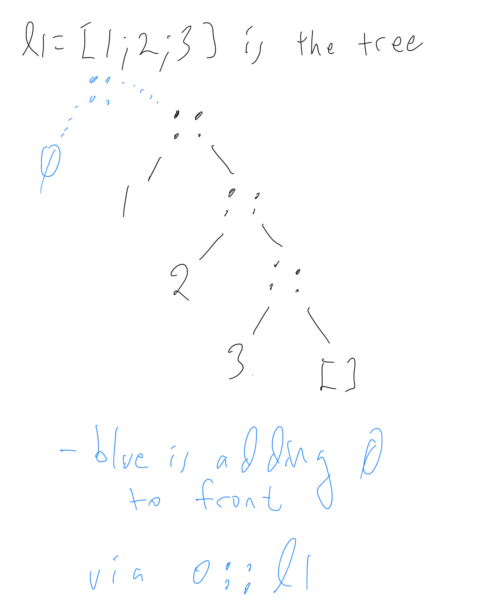

## Introduction to OCaml Programming

* We will be using the OCaml language for implementing interpreters, typecheckers and the like
* It is a *functional* programming language which of interest in its own right
* You are not going to learn how to be an OCaml software engineer in this class however, we are just going to cover the minimal OCaml needed for these tasks
   - Take [Functional Programming in Software Engineering](https://pl.cs.jhu.edu/fpse) for a focus on software engineering in OCaml
* OCaml itself has a very minimal set of features which can build up other features, we will also follow that in our toy langauges **Fb**, **FbV**, **FbR**, etc.

### What is OCaml?
* OCaml is a *strongly typed functional programming language*
   - Strongly typed means the compiler will detect type errors; you won't get them at runtime like in JavaScript/Python
   - Functional means an emphasis on *functions* as a key building block and use of functions as data (functions that themselves can take functions as arguments and return functions as results)
   - We will also take an emphasis on functions in our study of PLs as functions are more fundamental than e.g. objects/classes.


### The top loop

* We will begin exploration of OCaml in the interactive *top loop*
* A top loop is also called a read-eval-print loop or the console window for other languages; it also works like a terminal shell
* To install the top loop we are using, `utop`, follow the course [OCaml install instructions](../index.html).
* To run it, just type `utop` into a terminal window.

#### Simple integer operations in the top loop
(Note if you want to get all the code (only) of this webpage in a `.ml` file to load into your editor, download the file [lecture.ml](lecture.ml).)

```ocaml
3 + 4;; (* ";;" denotes end of input, somewhat archaic. *)
let x = 3 + 4;; (* give the value a name via let keyword. *)
let y = x + 5;; (* can use x now *)
let z = x + 5 in z - 1;; (* let .. in defines a local variable z *)
```

#### Boolean operations

```ocaml
let b = true;;
b && false;;
true || false;;
1 = 2;; (* = not == for equality comparison - ! *)
1 <> 2;;  (* <> not != for not equal *)
```

#### Other basic data -- see documentation for details
```ocaml
4.5;; (* floats *)
4.5 +. 4.3;; (* operations are +. etc not just + which is for ints only *)
30980314323422L;; (* 64-bit integers *)
'c';; (* characters *)
"and of course strings";;
```

#### Simple functions on integers

To declare a function `squared` with `x` its one parameter.  `return` is  implicit.
```ocaml
let squared x = x * x;; 
squared 4;; (* to call a function -- separate arguments with S P A C E S *)
```
 *  OCaml has no `return` statement; value of the whole body-expression is what gets returned
 *  Type is automatically **inferred** and printed as domain `->` range
 *  OCaml functions in fact always take only one argument - !  multiple arguments can be encoded (later)

Everything in OCaml returns values (i.e. is an 'expression') - no commands
```ocaml
if (x = 3) then (5 + 35) else 6;; (* ((x==3)?5:6)+1 in C *)
(if (x = 3) then 5 else 6) * 2;;
(* (if (x = 3) then 5.4 else 6) * 2;; *) (* type errors:  two branches of if must have same type *)
```

#### Fibonacci series example - `0 1 1 2 3 5 8 13 ...` 

Let's write a well-known function with recursion and if-then-else syntax

```ocaml
let rec fib n =     (* the "rec" keyword needs to be added to allow recursion *)
  if n <= 0 then 0
  else if n = 1 then 1
  else fib (n - 1) + fib (n - 2);; (* notice again everything is an expression, no "return" *)

fib 10;; (* get the 10th Fibonacci number *)
```

#### Anonymous functions aka "functions are just other values"

* Key advantage of FP: functions are just expressions; put them in variables, pass and return from other functions, etc.
* There is major power to this, which is why Java, Python, C++, etc have had higher-order functions added to them.

```ocaml
let add1 x = x + 1;; (* a normal add1 definition *)
let anon_add1 = (function x -> x + 1);; (* equivalent anonymous version; "x" is argument here *)
let anon_add1_fun = (fun x -> x + 1);; (* `function` can usually be shortened to `fun` *)
add1 3;;
(add1 4) * 7;;  (* note this is the same as add1 4 * 7 - application "binds tightest" *)
((fun x -> x + 1) 4) * 7;; (* can inline anonymous function; useless here but useful later *)
```

<a name="ii"></a>

## OCaml Lecture II

* Multiple argument functions - just leave s p a c e s between multiple arguments in both definitions and uses

```ocaml
let add x y = x + y;;
add 3 4;;
(add 3) 4;; (* same meaning as previous application -- two applications, " " associates LEFT *)
let add3 = add 3;; (* No need to give all arguments at once!  Type of add is int -> (int -> int) - "CURRIED" *)
add3 4;;
add3 20;;
(+) 3 4;; (* Putting () around any infix operator turns it into a 2-argument function: `(+)` is same as our `add` above *)
```

Conclusion: `add` is a function taking an integer, and returning a **function** which takes ints to ints.
So, `add` is in fact a **higher-order function**: it returns a function as result.

Observe `int -> int -> int` is parenthesized as `int -> (int -> int)` -- unusual **right** associativity

Be careful on operator precedence with this goofy way that function application doesn't need parens!
```ocaml
add3 (3 * 2);;
add3 3 * 2;; (* NOT the previous - this is the same as (add3 3) * 2 - application binds tighter than `*` *)
add3 @@ 3 * 2;; (* LIKE the original - @@ is like the " " for application but binds LOOSER than other ops *)
```

#### Declaring types in OCaml

  * While OCaml infers types for you it is often good practice to add those types to your functions, e.g.
  ```ocaml
  let add (x : int) (y : int) : int = x + y;;
  ```
  * Note that the parentheses are required, and the return type is at the end.
  * For the homeworks we will give you the types to make clear what the requirements are for the function.

### Simple Structured Data Types: Option and Result

* Before getting into "bigger" data types and how to declare our own, let's use one of the simplest structured data types, the built-in `option` type.
* It is used when either we have some data, or we have nothing.
* In standard PLs there is a `nil` or `Null` or `NULL` pointer which represents absence of data; `option` is a more precise version of those.

```ocaml
Some 5;;
(*  - : int option = Some 5 *)
```

* all this does is "wrap" the 5 in the `Some` tag
* Along with `Some`-thing 5, there can also be `None`-thing, nothing:

```ocaml
None;;
(* - : 'a option = None *)
```

 * Notice these are both in the `option` type .. either you have `Some` data or you have `None`.
 * These kinds of types with the capital-letter-named tags are called **variants** in OCaml; each tag wraps a different variant.
 * The `option` type is very useful; here is a simple example.

 ```ocaml
# let nice_div m n = if n = 0 then None else Some (m / n);;
val nice_div : int -> int -> int option = <fun>
# nice_div 10 0;;
- : int option = None
# nice_div 10 2;;
- : int option = Some 5
```

There is a downside with this though, you can't just use `nice_div` like `/`:

```sh
# (nice_div 5 2) + 7;;
Line 1, characters 0-14:
Error: This expression has type int option
       but an expression was expected of type int
```

  * This type error means the `+` lhs should be type `int` but is a `Some` value which is **not** an `int`.
  * `option` types are not coercable to integers (or any other type).

Here is another failed attempt which shows how `None` is not like `nil`/`Null`/`NULL`:
 ```ocaml
# let not_nice_div m n = if n = 0 then None else m / n;;
Line 1, characters 47-52:
Error: This expression has type int but an expression was expected of type
         'a option
```
- The `then` and `else` branches must return the same type, here they do not.
- The `int` and `int option` types have no overlap of members! 

#### Pattern matching first example

Here is a real solution to how elements of `option` types can be used:
```ocaml
# match (nice_div 5 2) with 
   | Some i -> i + 7 (* i is bound to what the Some wraps, 2 here *)
   | None -> failwith "This should never happen, we divided by 2";;
- : int = 9
```
* This shows how OCaml lets us *destruct* option values, via the `match` syntax.
* `match` is similar to `switch` in C/Java/.. but is much more flexible in OCaml
* The LHS in OCaml can be a general pattern which binds variables (the `i` here), etc
* Note that we turned `None` into a runtime exception via `failwith`.

One other way to deal with this division by zero issue is the function could itself raise an exception:

```ocaml
let div_exn m n = if n = 0 then failwith "divide by zero is bad!" else m / n;;
div_exn 3 4;;
```

* This has the property of not needing a match on the result.  
* Note that the built-in `/` also raises an exception, it more or less is doing what this example does.
* Exceptions are side effects though, we want to minimize their usage to avoid error-at-a-distance.
* The above examples show how exceptional conditions can either be handled via 
  - exceptions (the most common way, e.g. how Java deals with division by 0)
  - with Some/None in the return value; the latter is the C philosophy, C functions return `NULL` or `-1` if fail and the caller has to deal.

### Lists

* Lists are pervasive in OCaml
* They are **immutable** (cannot update elements in an existing list) so while they look something like arrays or vectors they are not
* Isn't it totally impossible to write useful programs with lists that we can't change??  Surprisingly, its not hard at all.

```ocaml
let l1 = [1; 2; 3];;
let l2 = [1; 1+1; 1+1+1];;
let l3 = ["a"; "b"; "c"];;
(* let l4 = [1; "a"];; *) (* error - All elements must have same type *)
let l5 = [];; (* empty list *)
```

#### Operations on lists.  

* Lists are represented internally as **binary trees** where the left children are all leaves.
* The tree nodes are `::` and are called *conses* (an historical term from Lisp)
* The list is then the list of these left children going down the tree.
* `::` is also an operation to build a new list by adding one element to the front of an existing list
* Since lists don't mutate, sub-lists can be *shared* (!)

```ocaml
3 :: [] (* also written [3], a singleton list -- tree with root ::, left sub tree 3, right sub tree empty list *) 
let l1 = 1 :: (2 :: (3 :: []));; (* equivalent to [1;2;3] *)
let l0 = 0 :: l1;; (* fast, just makes one new node, left is 0 right is l1 - l1 is shared with l0 *)
l1;; (* Notice that l1 did not change even though we put a 0 on - immutable always! *)
[1; 2; 3] @ [4; 5];; (* appending lists - slower, needs to cons 3 then 2 then 1 on front of [4;5] *)
```

Picture of `l1` and `l0`:



#### Destructing Lists with pattern matching

* You are used to using `.` (dot) to project out fields of data structures; in OCaml we instead pattern match nearly all the time
* Here is a simple example of pattern matching on a list to get the *head*, the first element.

```ocaml
let hd l =
  match l with
  |  [] -> None
  |  hd :: tl -> Some x (* the pattern hd :: tl  binds hd to the first elt, tl to ALL the others *)
;;
hd [1;2;3];; (* [1;2;3] is 1 :: [2;3] So the head is 1. *)
hd [1];; (* [1] is 1 :: []  So the head is 1. *)
hd [];;
```

#### Append

* Here is how list append is implemented, recurse on the first list (only):
```ocaml
let rec append l1 l2 =
  match l1 with
  |  [] -> l2
  |  hd :: tl -> hd :: (append tl l2) (* assume function works for shorter lists like tl *)
;;
append [1;2;3] [4;5];; (* Recall `[1;2;3]` is `1 :: [2;3]` so in first call hd is 1, tl is [2;3] *)
1 :: (append [2;3] [4;5]);; (* This is what the first recursive call is performing *)
```
* Pattern priority: pick the first matched clause
* The above two patterns are mutually exclusive so order is in fact irrelevant here


#### Applying a function to all list members

* Let us hint a bit at the power of higher-order functions with one example, `keep`.
* We will *pass in* a function as a parameter to `keep`
* The function we pass in returns `true/false` and we keep only the list elements it is `true` for
* (such a `true`/`false`-valued function is called a *predicate* in logic)
* This example starts to show why anonymous functions are so useful

```ocaml
let rec keep (l : 'a list) (p : 'a -> bool) : 'a list = 
  match l with
  |  [] -> [] (* no elements to check p on *)
  |  hd :: tl -> if p hd then hd :: keep tl p else keep tl p
;;
keep [33;-22;11] (fun n -> n > 0);; (* keep only the elements greater than 0 *)
keep ["hello";"this";"is";"";"fun";""] (fun s -> s <> "");; (* keep non-empty strings *)
```

Don't use non-exhaustive pattern matches! You will get a warning (and an error in compiler):

```ocaml
let dumb l = match l with
      | x :: y -> x;;
dumb [1;2;3];; (* this works to return head of list but.. *)
(* dumb [];; *) (* runtime error here *)
```

Built-in `List.hd` is the same as `dumb` and it is often a **dumb** function, don't use it unless it is 100% obvious that the list is not empty.


### List library functions
Fortunately many common list operations are in the `List` module in the standard library:

```ocaml
List.nth [1;2;3] 2;;
(* - : int = 3 *)
```
* We will discuss modules later, but for now just think of them as containers of a collection of functions types etc.  Something like a `package` in Java, or a Java `class` with only `static` methods.

Some more handy `List` library functions
```ocaml
List.length ["d";"ss";"qwqw"];;
List.concat [[1;2];[22;33];[444;5555]];;
List.append [1;2] [3;4];; 
[1;2] @ [3;4];; (* Use this equivalent infix syntax for append *)
```

* Type `#show List;;` into utop to get a dump of all the functions in `List`.
* NOTE: for assignment 1 you **cannot** use these `List.` functions, we want you to practice using recursion (you can use them after Assignment 1).
* The [Standard Library Reference page for lists](http://caml.inria.fr/pub/docs/manual-ocaml/libref/List.html) contains descriptions as well.
* There are similar modes for `Int`, `String`, `Float`, etc modules which similarly contain handy functions.

#### The Types of List Library Functions

* The types of the functions are additional hints as to their purpose, get used to reading them
* Much of the time when you mis-use a function you will get a type error
* `'a list` etc is a polymorphic aka generic type, `'a` can be *any* type. more later on that
```ocaml
List.length;;
(* - : 'a list -> int = <fun> *)
List.concat;;
(* - : 'a list list -> 'a list = <fun> *)
List.append;;
(* - : 'a list -> 'a list -> 'a list = <fun> *)
```

### Correctness of recursive Functions

Consider list reverse (no need to code as it is `List.rev`; this is just an example):
```ocaml
let rec rev l =
  match l with
  |  [] -> []
  | hd :: tl -> rev tl @ [hd] (* Assume by induction that rev tl "works" since its a shorter list. *)
;;
rev [1;2;3];; (* recall [1;2;3] is equivalent to 1 :: [2;3] *)
```

Let us argue why this works.

We assume we have a notion of "program fragments behaving the same", `~=`.
 -  e.g. `1 + 2 ~= 3`, `1 :: [] ~= [1]`, etc.  
 -  (`~=` is called "operational equivalence", we will define it later in the course)

Before doing the general case, here are some equivalences we can see from the above program run 
(by running it in our heads):
```
rev [1;2;3] 
~= rev (1 :: [2;3]) (by the meaning of the [...] list syntax)
~= (rev [2;3]) @ [1]  (the second pattern is matched: hd is 1, tl is [2;3] and run the match body)
.. assuming it "works" for smaller lists, we have
~= [3;2] @ 1
~= [3;2;1]
``` 

We now want to generalize this to any list, not just `[1;2;3]`: use induction to prove it.

Let P(n) mean "for any list l of length n, `rev l ~=` its reverse".

#### Tangent: review of why induction works

Recall an induction principle:
To show P(n) for all in, it suffices to show 
  1) P(0), and 
  2) P(k-1) holds implies P(k) holds for any natural number k>0.

* Why does this work??
* Think of induction step 2) as a **proof macro** with k a parameter
* Since it holds for any k, we can plug in any particular number into the macro
   - plug in k=1: P(0) implies P(1) has to hold
   - plug k=2: P(1) implies P(2) has to hold 
   - ...

So, if we showed 1) and 2) above, 
- P(0) is true by 1)
- P(1) is true because letting k=1 in 2) we have P(0) implies P(1),
    and we just showed we have P(0), so we also have P(1).
- P(2) is true because letting k=2 in 2) we have P(1) implies P(2),
    and we just showed we have P(1), so we also have P(2).
- P(3) is true because letting k=3 in 2) we have P(2) implies P(3),
    and we just showed we have P(2), so we also have P(3).
- ... etc for all k

Let us now prove reverse reverses, by induction.

Theorem: For any list `l` of length n, `rev l ~=` the reverse of `l` .
Proof.  Proceed by induction to show this property for any n.
  1) for n = 0, `l ~= []` since that is the only 0-length list.
     `rev [] ~= []` which is `[]` reversed, check!
  2) Assume for any (k-1)-length list `l` that `rev l ~= l` reversed.
     Show for any k length list, i.e. for any list `x :: l`
     that `rev (x :: l) ~= (x :: l)` reversed:

OK, by computing, `rev (x :: l) ~= rev l @ [x]`.
Now by the induction hypothesis, `rev l` is `l` reversed.
So, since `(l` reversed`) @ [x]` reverses the whole list `x :: l`,
`rev (x :: l) ~= (x :: l)` reversed.
This completes the induction step.

QED.    

<a name="iii"></a>

##  OCaml Lecture III

### Tuples

* Think of tuples as fixed length lists, where the types of each element can differ, unlike lists
* A 2-tuple is a pair, a 3-tuple is a triple.
* Tuples are "and" data structures: this *and* this *and* this.  `struct` and objects are also "and" structures (variants like `Some/None` are OCaml's "or" structures, more later on them)

```ocaml
(2, "hi");;             (* type is int * string -- '*' is like "x" of set theory, a product *)
let tuple = (2, "hi");; (* tuple elements separated by commas, list elements by semicolon *)
(1,1.1,'c',"cc");;
```
Tuple pattern matching
```ocaml
let tuple = (2, "hi", 1.2);;

match tuple with
  | (f, s, th) -> s;;

(* shorthand for the above - only one pattern, can use let syntax *)
let (f, s, th) = tuple in s;;

(* Parens around tuple not always needed *)
let i,b,f = 4, true, 4.4;;

(* Pattern matching on a pair allows parallel pattern matching *)

let rec eq_lists l1 l2 = (* note `l1 = l2` in OCaml will work so no need to actually write this .. *)
  match l1,l2 with
  | [], [] -> true
  | hd :: tl, hd' :: tl' -> if hd <> hd' then false else eq_lists tl tl'
  | _ -> false (* _ is a catch-all pattern; lengths must differ if this case is hit *)
```

#### Consequences of immutable variable declarations on the top loop

 * All variable declarations in OCaml are **immutable** -- value will never change
 * Helps in reasoning about programs, we know the variable's value is fixed
 * But can be confusing when shadowing (re-definition) happens

Consider the following sequence of inputs into the top loop:
```ocaml
let y = 3;;
let x = 5;;
let f z = x + z;;
let x = y;; (* this is a shadowing re-definition, not an assignment! *)
f y;; (* 3 + 3 or 5 + 3 - ?? Answer: the latter since x WAS 5 at point of f def'n. *)
```

* To understand the above, realize that the top loop is conceptually an open-ended series of let-ins which never close:

```ocaml
(let y = 3 in
 ( let x = 5 in
   ( let f z = x + z in
     ( let x = y in  (* this is a shadowing re-definition of x, NOT an assignment *)
       (f y)
     )
   )
 )
)
;;
```

The above might make more sense if you consider similar-in-spirit C pseudo-code:
```c
 { int y = 3;
   { int x = 5;
     { int (int) f = z -> return(x + z); // imagining higher-order functions in C
       { int x = y; (* shadows previous x in C *)
         return(f(y)); 
  }}}})
```


Function definitions are similar, you can't mutate an existing definition, only shadow it.

```ocaml
let f x = x + 1;;
let g x = f (f x);;
(* lets "change" f, say we made an error in its definition above *)
let f x = if x <= 0 then 0 else x + 1;;
g (-5);; (* g still refers to the initial f - !! *)
let g x = f (f x);; (* FIX g to refer to new f: resubmit (identical) g code *)
g (-5);; (* sees new f now *)
```

* Moral: **re-load all dependent functions if you change any function**
* For programming assignments, if you want to play with your code you can copy/paste stuff into the top loop to test, but beware that functions depending on the function you changed may not change
* To be safe, save `assignment.ml`, quit `utop`,  type `dune utop` again which will compile and load all your code.  You will need to type `open Assignment;;` into `utop` once it is going so all your functions are available.
* Note you can alternatively type into `utop` the command `#use "src/assignment.ml"` and it is as if you copy/pasted the whole file into `utop`.
* Run `dune test` to check your overall progress to see which tests pass.

Moral: there are many ways to develop in OCaml, experiment with these different modes to see which is working best for you.

#### Mutually recursive functions

* Mutually recursive functions require special syntax in OCaml
* Warm up: write a copy function on lists
  - List copy is in fact **100% useless** in OCaml because lists are immutable - variables can *share* a single copy without any issues
  - This property is called *referential transparency*

```ocaml
let rec copy l =
  match l with
  | [] -> []
  | hd :: tl ->  hd::(copy tl);;

let result = copy [1;2;3;4;5;6;7;8;9;10]
```
* Argue by induction that this will copy: `(copy tl)` is a call on a shorter list so can assume is correct


Now lets do some mutual recursion.  Copy every other element, defined by mutual recursion via `and` syntax

```ocaml
let rec copy_odd l = match l with
  | [] -> []
  | hd :: tl ->  hd :: (copy_even tl) (* keep the head in this case *)
and  (* new keyword for declaring mutually recursive functions *)
  copy_even l = match l with
  |  [] -> []
  | hd :: tl -> copy_odd tl;; (* throw away the head in this case *)

copy_odd [1;2;3;4;5;6;7;8;9;10];;
copy_even [1;2;3;4;5;6;7;8;9;10];;
```

### Using `let .. in` to define local functions

* If functions are *only* used locally within one function, it can be defined inside that function - more modular
* Suppose we only wanted to use `copy_odd`: here is a version that hides `copy_even`:

```ocaml
let copy_odd ll =
  let rec copy_odd_local l = match l with
    |  [] -> []
    | hd :: tl ->  hd::(copy_even_local tl)
  and
    copy_even_local l = match l with
    |        [] -> []
    | hd :: tl -> copy_odd_local tl
  in
  copy_odd_local ll;;

assert(copy_odd [1;2;3;4;5;6;7;8;9;10] = [1;3;5;7;9]);;
```

- `copy_even_local` is not available in the top loop, it is local to `copy_odd` function only, just like local variables but its a function.
- Note how the last line "exports" the internal `copy_odd_local` by forwarding the `ll` parameter to it
- In general if you need an auxiliary function for one of the homework questions, you can either define it at the top level
  ```ocaml
  let aux n = n + 1 (* super simple example auxiliary function *)
  let solution i = ... aux (i*i) ...
  ```
  or make it purely local:
    ```ocaml
  let solution i = 
    let aux n = n+1 in
    ... aux (i*i) ...
    ```

### Higher Order Functions

Higher order functions are functions that either
 * take other functions as arguments
 * or return functions as results (which we already saw with multi-arg functions)

Why?
 * "pluggable" programming by passing in and out chunks of code
 * greatly increases reusability of code since any varying code can be pulled out as a function to pass in
 * We alreayd saw Curried functions such as `add : int -> (int -> int)` which *return* functions
 * Also `keep : 'a list -> ('a -> bool) -> 'a list` above let us plug in a predicate (function)
 * Lets show more power by generalizing an algorithm to extract code we can then plug in

Example: append `"gobble"` to each word in a list of strings

```ocaml
let rec append_gobble l =
  match l with
  | [] -> []
  | hd::tl -> (hd ^ "-gobble") :: append_gobble tl;;

append_gobble ["have";"a";"good";"day"];;
("have" ^"gobble") :: ("a"^"gobble") :: append_gobble ["good";"day"];;
```

* At a high level, the common pattern is "apply a function to every list element and make a list of the results"
* So, lets pull out the "append gobble" action as a **function parameter** so it will be it code we can plug in
* The resulting function is called `map` (note it is built-in as `List.map`):
```ocaml
let rec map (f : 'a -> 'b) (l : 'a list) : 'b list =  (* function f is an argument here *)
  match l with
  | [] -> []
  | hd::tl -> (f hd) :: map f tl;;
```

```ocaml
let another_append_gobble = map (fun s -> s ^ "-gobble");; (* give only the first argument -- Currying *)
another_append_gobble ["have";"a";"good";"day"];;
map (fun s -> s^"-gobble") ["have";"a";"good";"day"];; (* don't have to name the intermediate application *)
```

Mapping on lists of pairs - in and out lists can be different types.
```ocaml
map (fun (x,y) -> x + y) [(1,2);(3,4)];;
let flist = map (fun x -> (fun y -> x + y)) [1;2;4] ;; (* make a list of functions - why not? *)
```
* This aligns with the type of `map`, `('a -> 'b) -> 'a list -> 'b list ` - `'a` and `'b` can differ.


### Solving some simple problems

Here are some practice problems and their solutions for your own self-study (may skip in lecture depending on time available)

Also see the [OCaml page examples](index.html#examples) for more sources for example problems and solutions.

1. Write a function `to_upper_case` which takes a list (l) of characters and returns a list which has the same characters as l, but capitalized (if not already).

Notes: 
a. Assume that the capital of characters other than alphabets
            (A - Z or a - z), are the characters themselves e.g.

```
                character               corresponding capital character

                    a                             A
                    z                             Z
                    A                             A
                    1                             1
                    %                             %
```

b. You can only use `Char.code` and `Char.chr` library functions. You **cannot** use `Char.uppercase`.

**Answer:**
```ocaml
let to_upper_char c =
  let c_code = Char.code c in
  if c_code >= 97 && c_code <= 122 then Char.chr (c_code - 32)
  else c;;

let rec to_upper_case l =
  match l with
   | [] -> []
   | c :: cs -> to_upper_char c :: to_upper_case cs
;;
```

Test
```ocaml
assert(to_upper_case ['a'; 'q'; 'B'; 'Z'; ';'; '!'] = ['A'; 'Q'; 'B'; 'Z'; ';'; '!']);;
```

Could have used map instead (note map is built in as `List.map`):

```ocaml
let to_upper_case l = List.map to_upper_char l ;;
```

Could have also defined it even more simply - partly apply the Curried map:

```ocaml
let to_upper_case = List.map to_upper_char ;;
```

2. Write a function `partition` which takes a predicate (`p`) and a list (`l`) as arguments  and returns a tuple `(l1, l2)` such that `l1` is the list of all the elements of `l` that satisfy the predicate p and l2 is the list of all the elements of `l` that do NOT satisfy `p`. The order of the elements in the input list (`l`) should be preserved.

Note: A predicate is any function which returns a boolean. e.g. `let is_positive n = (n > 0);;`

**Answer:**
```ocaml
let rec partition p l =
  match l with
  |[] -> ([],[])
  | hd :: tl ->
    let (posl,negl) = partition p tl in
    if (p hd) then (hd :: posl,negl)
    else (posl,hd::negl);;
```
Test

```ocaml
let is_positive n = n > 0 in
assert(partition is_positive [1; -1; 2; -2; 3; -3] = ([1; 2; 3], [-1; -2; -3]))
```

3. Write a function `diff` which takes in two lists l1 and l2 and returns a list containing all elements in l1 not in l2.

Note: You will need to write another function `contains x l` which checks  whether an element `x` is contained in a list `l` or not.

**Answer:**
```ocaml
let rec contains x l =
  match l with
  | [] -> false
  | y :: ys -> x = y || contains x ys
;;

let rec diff l1 l2 =
  match l1 with
  | [] -> []
  | hd :: tl ->
      if contains hd l2 then diff tl l2
      else hd :: diff tl l2
;;
```

Tests
```ocaml
assert(contains 1 [1; 2; 3]);;
assert(not(contains 5 [1; 2; 3]));;
assert(diff [1;2;3] [3;4;5] = [1; 2]);;
assert(diff [1;2] [1;2;3] = []);;
```

All of the above functions can simply pass the tail of the list in the recursion.  Sometimes you need to pass additional information *down* the recursion to *accumulate* something.  For example lets write a `list_max` function which returns the maximal integer in a list.  Note that the list could be empty, we will return `Int.min_int` in this case, the smallest integer.
```ocaml
let rec list_max_aux n l = (* invariant: n is the maximal integer seen thus far *)
  match l with 
  | [] -> n
  | hd :: tl -> if hd > n then list_max_aux hd tl else list_max_aux n tl
let list_max = list_max_aux Int.min_int (* prime the pump *)
```

<a name="iv"></a>

## OCaml Lecture IV

* There is a better way to program over lists than to use `let rec`, it is called *combinator programming* - use the library functions
* We already saw this with `map` - we didn't need to write `append_gobble` directly, instead we could use `map`.
### Folds

 * `fold_left`/`fold_right` use a binary function to combine list elements
 * Think of `fold`ing as something you feed just the "base case code" and the "recursive case code" to for a function on lists, and it builds a recursive function for you.
 * As with `map` let us first write a concrete combiner and then pull out the particular combination code as a parameter

```ocaml
let rec char_list_to_string l =
  match l with 
  | [] -> "" (* "" is the "base case code" we will want to plug in later *)
  | elt :: elts ->  (* we are calling the current list element `elt`, thats the convention in folding  *)
    let accum = char_list_to_string elts in (* this is what `accum` is, the *accumulation* from recursing *)
      (Char.escaped elt)^accum;;  (* this is the "recursive case" code: put elt on front of result thus far *)
char_list_to_string ['h';'e';'l';'l';'o';'!'];;
```

Let us make a minor tweak to this to make clear that the recursive case code can be pulled out as a function:
```ocaml
let rec char_list_to_string l =
  match l with 
  | [] -> ""
  | elt :: elts -> 
    let accum = char_list_to_string elts in 
      let f = fun elt accum -> (Char.escaped elt)^accum in f elt accum (* same effect as above, we did a no-op *)
```

* Now, `fold_right` just takes the base case (`""` here) and the recursion code (`f` here) as general parameters:

```ocaml
let rec fold_right f l init =
  match l with 
  | [] -> init (* "" is now the parameter init *)
  | elt :: elts -> 
    let accum = fold_right f elts init in (* same as above but forwarding extra parameters f / init *)
      f elt accum (* same code as above but f passed in now as a parameter *)
```

* Now let's re-constitute the particular example we had above by passing the base/recursion code back in again:

```ocaml
fold_right (fun elt accum -> (Char.escaped elt)^accum) ['a';'b';'c'] ""
```

Another example with summating done manually (`init` case is `0`, function is `(+)` which is `fun elt accum -> elt + accum`)
```ocaml
let rec summate_right l = match l with
    | []   -> 0
    | elt :: elts ->  (+) elt (summate_right elts)
    ;;
summate_right [1;2;3];; (* = (1+(2+(3+0))) - observe we start from *right* side, fold_right is fold-starting-from-right *)
```
And now the same thing using our general `fold_right` (which is also the same as the library function `List.fold_right`)
```ocaml
List.fold_right (+) [1;2;3] 0
```
which is the same as
```ocaml
List.fold_right (fun elt accum -> elt + accum) [1;2;3] 0
```
if we wrote out the `+`.  Note one parameter is the current element and the other is the accumulation.

* Many recursive functions on lists can be expressed with `List.fold_right`: they are simple accumulations over a base case.

```ocaml
let rev l = List.fold_right (fun elt accum -> accum @ [elt]) l [];; (* `accum` is reversed tail, `elt` is current head *)
let map f l = List.fold_right (fun elt accum -> (f elt)::accum) l [];; (* `accum` has f applied to all elts in tail *)
let filter f l = List.fold_right (fun elt accum -> if f elt then elt::accum else accum) l [];; 
```

#### Folding left

* `fold_left` accumulates "on the way down" (we pass down the f computed value), whereas `fold_right` accumulates "on the way up" (the f computes *after* the recursive call)
* Recall the `list_max_aux` function above which accumulated the maximum element seen.
* Lets rename the variables we used before to the `accum/elt/elts` ones we use for folding

```ocaml
let rec list_max_aux accum l = (* invariant: accum is the maximal integer seen thus far *)
  match l with 
  | [] -> accum (* we are 100% done, and by the invariant this is the biggest integer seen to its the answer *)
  | elt :: elts -> if elt > accum then list_max_aux elt elts else list_max_aux accum elts;;
list_max_aux (Int.min_int) [1;2;3;2;-1];;
```

Here `accum` is already a parameter since max needs a seed; lets rewrite this to encapsulate the recursion case as `f`:
```ocaml
let rec list_max_aux accum l = 
  match l with 
  | [] -> accum
  | elt :: elts -> let f = fun accum elt -> if elt > accum then elt else accum in
       list_max_aux (f accum elt) elts
```
* This code is a bit different than above because we pushed the condition in, but its the same effect
* Observe that by convention the `accum`/`elt` parameters are in opposite order on `f` for left folding
* We can now make the `f` also a parameter, which gives us `fold_left`:

```ocaml
let rec fold_left f accum l = 
  match l with 
  | [] -> accum
  | elt :: elts ->  fold_left f (f accum elt) elts;;
```
Again all we did was to pull out `f` as a parameter, let's pass it back in to show that:
```ocaml
fold_left (fun accum elt -> if elt > accum then elt else accum) (Int.min_int) [1;2;3;2;-1];;
```

* Observe how when we get to the bottom of the recursion (empty list) we have the fully final value in `accum` 
* So we just need to return ... return ... return it all the way to the top without touching it.

For summation we can also use `fold_left` which is now working from the left side:

```ocaml
List.fold_left (+) 0 [1;2;3];; (* computes ((0 + 1) + 2) + 3); note using library function version List.fold_left here *)
```

* Notice we get the same answer for left and right fold, because the operator `(+)` happens to be commutative and associative
   - `((0 + 1) + 2) + 3) ~= (0 + (1 + ( 2 + 3)))`
* String concatenation `^` is not commutative so we see a difference in left vs right folding there:

```ocaml
fold_left (^) "z" ["a";"b";"c"] ;;
fold_right (^) ["a";"b";"c"] "z" ;;
```

This also shows how the parameter order is slightly different in the two:
* `List.fold_left`'s type is `('acc -> 'a -> 'acc) -> 'acc -> ('a list) -> 'acc`
* `List.fold_right`'s type is `('a -> 'acc -> 'acc) -> 'a list -> 'acc -> 'acc`

Here are a few more examples of folding left:
```ocaml
let length l = List.fold_left (fun accum elt -> accum + 1) 0 l;; (* adds accum, ignores elt *)
let rev l = List.fold_left (fun accum elt -> elt::accum) [] l;; (* e.g. rev [1;2;3] = (3::(2::(1::[]))) - much faster! *)
```

* For both of these, assume by induction that `accum` has the accumulated result for all list elements earlier in the list
* Consider computing `rev [1;2;3]` when we have for example gotten to `[3]` (`elt` = `3`) in the recursion
* At this point can assume the `accum` is `[2;1]`, the result for previous elts we passed.
*  So, put `3` on the front (the `elt::accum`), and we are done!

### Pipeling and composition

* Pipelining is like an assembly line: feed output of one stage into the next stage, in a sequence.
* Example: get the element nth from the end from a list, by first reversing and then getting nth element from front.

First try, which works fine:
```ocaml
let nth_end l n = List.nth (List.rev l) n;;
```

* But, from the analogy of shell pipes `|`, we are "piping" the output of `rev` into `nth` for some fixed n.  
* Here is an equivalent way to code that using OCaml pipe notation, `|>`

```ocaml
let nth_end l n = l |> List.rev |> (Fun.flip(List.nth) n);;
```
* All `[1;2] |> List.rev` in fact does is apply the second argument to the first - very simple!
* The type gives it away: `(|>)` has type `'a -> ('a -> 'b) -> 'b`
* The `Fun.flip` is needed to put the list argument second, not first
  - it is another interesting higher-order function, with type `('a -> 'b -> 'c) -> ('b -> 'a -> 'c)`.
* So, e.g. `(Fun.flip(List.nth) 2)` is a function taking a list and returning the 2nd element.
#### Function Composition: functions both in and out

Composition operation `g o f` from math: take two functions, return their composition
```ocaml
let compose g f = (fun x -> g (f x));;
compose (fun x -> x+3) (fun x -> x*2) 10;;
```
* The type again tells the whole story: `('a -> 'b) -> ('c -> 'a) -> ('c -> 'b)`

### Currying

* Names the way multi-argument functions work in OCaml: return a function expecting next parameter
* Logician Haskell Curry originally came up with the idea in the 1930's
* First lets recall how multi-argument functions in OCaml are Curried

```ocaml
let add_c x y = x + y;; (* recall type is int -> int -> int which is int -> (int -> int) *)
add_c 1 2;; (* recall this is the same as '(add_c 1) 2' *)
let tmp = add_c 1 in tmp 2;; (* the partial application of arguments - tmp is a function *)
(* An equivalent way to define `add_c`, clarifying what the above means *)
let add_c = fun x -> (fun y -> x + y);;
```

Here is the *non-Curried* version: use a *pair of arguments* instead
```ocaml
let add_nc (x,y) = x + y;; (* type is int * int -> int - no way to partially apply *)
```

* Notice how the type of `add_nc` differs from `add_c`: `int * int -> int` vs `int -> int -> int`.
* Fact: these two approaches to defining a 2-argument function are isomorphic:
`'a * 'b -> 'c` ~= `'a -> 'b -> 'c`
* (This isomorphism also holds in set theory, you may have already seen it)

To "prove" this we make functions (on functions) to convert from one form to the other
* `curry`   - takes in non-curry'ing 2-arg function and returns a curry'ing version
* `uncurry` - takes in curry'ing 2-arg function and returns an non-curry'ing version

Since we can then go back and forth between the two representations, they are **isomorphic**.

```ocaml
let curry fnc = fun x -> fun y -> fnc (x, y);;
let uncurry fc = fun (x, y) -> fc x y;;

let new_add_nc = uncurry add_c;;
new_add_nc (2,3);;
let new_add_c  = curry   add_nc;;
new_add_c 2 3;;
```

Observe the types themselves pretty much specify their behavior
```
curry : ('a * 'b -> 'c) -> ('a -> 'b -> 'c)
uncurry : ('a -> 'b -> 'c) -> ('a * 'b -> 'c)
```

```ocaml
let noop1 = curry (uncurry add_c);; (* a no-op *)
let noop2 = uncurry (curry add_nc);; (* another no-op; noop1 & noop2 together show isomorphism *)
```
### Misc OCaml

See [module Stdlib](http://caml.inria.fr/pub/docs/manual-ocaml/libref/Stdlib.html) for various functions available in the OCaml top-level like `+`, `^` (string append), `print_int` (print an integer), etc.

See [the Standard Library](http://caml.inria.fr/pub/docs/manual-ocaml/stdlib.html) for modules of functions for `List`s, `String`s, `Int`egers, as well as `Set`s, `Map`s, etc, etc.

```ocaml
print_string ("hi\n");;
```

Some `Stdlib` built-in exception generating functions (more on exceptions later)
```sh
(failwith "BOOM!") + 3 ;;
```

Invalid argument exception `invalid_arg`:
```sh
let f x = if x <= 0 then invalid_arg "Let's be positive, please!" else x + 1;;
f (-5);;
```

Type abbreviations are possible via keyword `type`
```ocaml
type intpair = int * int;;
let f (p : intpair) : int = match p with
                      (l, r) -> l + r
;;
(2,3);; (* ocaml doesn't call this an intpair by default *)
f (2, 3);; (* still, can pass it to the function expecting an intpair *)
((2,3):intpair);; (* can also explicitly tag data with its type *)
```

### Variants

We saw a simple examples of variants earlier in the `option` type; now we go into the full possibilities
  - Related to `union` types in C or `enum`s in Java: "this OR that OR theother"
  - Like lists/tuples they are **immutable** data structures
  - Each case of the union is identified by a name called a *constructor* which serves for both
      - constructing values of the variant type
      - destructing them by pattern matching


Example of how to declare a new variant type for doing mixed arithmetic (integers and floats)

```ocaml
type mynumber = Fixed of int | Floating of float;;  (* read "|" as "or" *)
Fixed(5);; (* tag 5 as a Fixed *)
Fixed 5;; (* parens optional as is often the case in OCaml *)
Floating 4.0;; (* tag 4.0 as a Floating *)
```
  - Constructors must start with Capital Letter to distinguish from variables (`Fixed` and `Floating` here)
  - The `of` indicates what type of thing is under the wrapper, leave out `of` and there will be nothing
  - Type declarations are required but once they are in place type inference on them works
  - Note constructors look like functions but they are **not** -- you always need to give the argument

Destruct variants by pattern matching like we did for `Some/None` option type values:

```ocaml
let ff_as_int x =
    match x with
    | Fixed n -> n
    | Floating z -> int_of_float z;;

ff_as_int (Fixed 5);; (* beware that ff_as_int Fixed(5) won't parse properly!!  Super commmon error!
                         ff_as_int @@ Fixed 5 will though *)
```

An example using the above variant

```ocaml
let add_num n1 n2 =
   match n1, n2 with    (* note use of pair here to parallel-match on two variables  *)
     | Fixed i1, Fixed i2 -> Fixed   (i1 + i2)
     | Fixed i1, Floating f2 -> Floating(float i1 +. f2) (* need to coerce with `float` function *)
     | Floating f1, Fixed i2 -> Floating(f1 +. float i2) (* ditto *)
     | Floating f1, Floating f2 -> Floating(f1 +. f2)
;;

add_num (Fixed 10) (Floating 3.14159);;
```

Multiple data items in a single variant case?  Can use tuple types

```ocaml
type complex = CZero | Nonzero of float * float;;

let com = Nonzero(3.2,11.2);;
let zer = CZero;; (* example of a variant without a payload *)
```

#### Recursive data structures 
  - An important use of variant types
  - Functional programming is highly suited for computing over tree-structured data
  - Recursive types can refer to themselves in their own definition
  - Similar in spirit to how C structs can be recursive (but, no pointer needed here)

* Warm-up: homebrew lists - built-in list type is not in fact needed
*  `Mt` represents `[]`, `Cons(hd,tl)` represents `hd::tl`

```ocaml
type 'a mylist = Mt | Cons of 'a * ('a mylist);;
let mylisteg = Cons(3,Cons(5,Cons(7,Mt)));; (* equivalent in spirit to [3;5;7] *)
```
* First notice that we can refer to `mylist` in its own type definition: its a *recursive type*
* Also observe how above type takes a (prefix) argument, `'a` -- `mylist` is a type function, `'a` is the type of list elements
* Perhaps better syntax would have been `type mylist(t) = Mt | Cons of t * (mylist(t))`

* Coding is analogous with built-in lists but without special sugar to make lists like `[1;2;3]`
* Lets write `map` as a test to show how easy it is
```ocaml
let rec map ml f =
  match ml with
    | Mt -> Mt
    | Cons(hd,tl) -> Cons(f hd,map tl f);;

let map_eg = map mylisteg (fun x -> x - 1);;
```

<a name="v"></a>

##  OCaml Lecture V

#### Trees

* Binary trees are like lists but with two self-referential sub-structures not one
* Here is one tree definition; note the data is (only) in the nodes here
* ... n-ary trees are a direct generalization of this pattern

```ocaml
type 'a btree = Leaf | Node of 'a * 'a btree * 'a btree;;
```

Example trees

```ocaml
let whack = Node("whack!",Leaf, Leaf);;
let bt = Node("fiddly ",
            Node("backer ",
               Leaf,
               Node("crack ",
                  Leaf,
                  Leaf)),
            whack);;

(* Type error; like lists, tree data must have uniform type: *)
(* Node("fiddly",Node(0,Leaf,Leaf),Leaf);; *)
```

Functions on binary trees are similar to functions on lists: use recursion

```ocaml
let rec add_gobble binstringtree =
   match binstringtree with
   | Leaf -> Leaf
   | Node(y, left, right) ->
       Node(y^"gobble",add_gobble left,add_gobble right)
;;
```
 * Remember, as with lists this is *not* mutating the tree, its building a "new" one
 * Also as with `List.map` earlier we could write a `tree_map` function over trees since this is the common pattern of "make a new tree by applying some function `f` to each element of the tree" (we won't in fact but it would be a good exercise)

Let us now write a binary tree `lookup` function:

```ocaml
let rec lookup x bintree =
  match bintree with
  | Leaf -> false
  | Node (y, left, right) ->
      if x = y then true else if x < y then lookup x left else lookup x right
;;

lookup "whack!" bt;;
lookup "flack" bt;;
```

Let us now define how to insert an element in sorted order.
```ocaml
let rec insert x bintree =
   match bintree with
   | Leaf -> Node(x, Leaf, Leaf)
   | Node(y, left, right) ->
       if x <= y then Node(y, insert x left, right)
       else Node(y, left, insert x right)
;;
```

* This is also **not mutating** -- it returns a whole new tree - !
* If you then want to insert another element you need to pass the result from the previous call.

```ocaml
let goobt = insert "goober " bt;;
bt;; (* observe bt did not change after the insert *)
let gooobt = insert "slacker " goobt;; (* pass in goobt to accumulate both additions *)
let manyt = List.fold_left (Fun.flip insert) Leaf ["one";"two";"three";"four";"five";"six"] (* folding for serial insert *)
```

* You have already been programming with immutable data structures -- lists
* For trees you are used to mutating to insert, delete, etc so takes some getting used to
* It looks really inefficient since an insertion is making a "totally new tree"
   - but, the compiler can in fact share all subtrees along the spine to the new node - "only" log n cost
   - referential transparency at work

### End Core OCaml used in the course

* The bulk of the assignments only use what we covered above
* We will now *very* quickly cover a few more features which we will rarely or never use
  - Note that the toy languages we study will copy OCaml to some degree so we at least want a basic understanding of OCaml's records, state, exceptions
  - **FbR** will be our **Fb** records extension, **FbS** for state, and **FbX** for eXceptions.

### Records
  - Like tuples but with labels on fields.
  - Similar to the structs of C/C++.
  - The types *must* be declared with `type`, just like OCaml variants.
  - Also like variants and tuples they can be used in pattern matches.
  - Also also record fields are **immutable** by default, so not like Python/Javascript dictionaries/objects

Example: a declaring record type to represent rational numbers

```ocaml
type ratio = {num: int; denom: int};;
let q = {num = 53; denom = 6};;
```

Destructing records via pattern matching:
```ocaml
let rattoint r =
 match r with
   {num = n; denom = d} -> n / d;;
```

Only one pattern matched so can again inline pattern in function's/let's
```ocaml
let rat_to_int {num = n; denom = d} =  n / d;;
```

Equivalently could use standard method of dot projections, but happy path in OCaml is patterns
```ocaml
let unhappy_rat_to_int r  =
   r.num / r.denom;;
```

One more example function with records
```ocaml
let unhappy_add_ratio r1 r2 = 
  {num = r1.num * r2.denom + r2.num * r1.denom; 
   denom = r1.denom * r2.denom};;

unhappy_add_ratio {num = 1; denom = 3} {num = 2; denom = 5};;

let happy_add_ratio {num = n1; denom = d1} {num = n2; denom = d2} = 
  {num = n1 * d2 + n2 * d1; denom = d1 * d2};;
```

#### End of Pure Functional programming in OCaml
* On to side effects
* But before heading there, remember to stay OUT of side effects unless *really* needed - that is the happy path in OCaml coding
* The autograder may let you get away with side effects on assignment 1/2 but you will get a manual ding by the CAs.

### State
 *   Variables in OCaml are **never** directly mutable themselves; only (indirectly) mutable if they hold a
      - reference
      - mutable record
      - array

Indirect mutability - variable itself can't change, but what it points to can.
 - items are immutable unless their mutability is explicitly declared

### Mutable References

* References are more like standard PL variables which can change but there are some subtle differences
  - You can't make a reference without any value in it, there is no `null` pointer possible.
  - References are more an *immutable* pointer to a *mutable* block, they are not directly mutable

```ocaml
let x = ref 4;;    (* declare initial value when creating; type is `int ref` here *)
```

Meaning of the above: x forevermore (i.e. forever unless shadowed) refers to a fixed cell.  The **contents** of that fixed call **can** change, but not x.

```ocaml
(* x + 1;; *) (* a type error ! *)
!x + 1;; (* need `!x` to get out the value; parallels `*x` in C *)
x := 6;; (* assignment - x must be a ref cell.  Returns () - goal is side effect *)
!x;; (* Mutation happened to contents of cell x *)
let x_alias = x;; (* make another name for x since we are about to shadow it *)
let x = ref "hi";; (* does NOT mutate x above, instead another shadowing definition *)
!x_alias;; (* confirms the previous line was not a mutation, just a shadowing *)
```

#### Refs are "really" mutable records
* `'a ref` is in fact implemented by an OCaml *mutable record* which has one field named `contents`:
* `'a ref` abbreviates the type `{ mutable contents: 'a }`
* The keyword `mutable` on a record field means it can be mutated

```ocaml
let x = { contents = 4};; (* identical to `let x = ref 4` *)
x := 6;;
x.contents <- 7;;  (* same effect as previous line: backarrow mutates a field *)
!x + 1;;
x.contents + 1;; (* same effect as previous line *)
```

Declaring your own mutable record: put `mutable` qualifier on field

```ocaml
type mutable_point = { mutable x: float; mutable y: float };;
let translate p dx dy =
                p.x <- (p.x +. dx); (* observe use of ";" here to sequence effects *)
                p.y <- (p.y +. dy)  (* ";" is useless without side effects (think about it) *)
                                ;;
let mypoint = { x = 0.0; y = 0.0 };;
translate mypoint 1.0 2.0;;
mypoint;;
```

Observe: mypoint is immutable at the top level but it has two spots `x`/`y` in it where we can mutate

### Arrays
 - Fairly self-explanatory, we will just flash over this
 - Arrays are lists but we 
   - *can* mutate elements 
   - *can* quickly (constant time) access the n-th element
   - but are *hard* to extend or shorten
 - The main annoyance is the syntax is non-standard since `[..]` is already used for lists
 - Have to be initialized before using
   - in general there is no such thing as "uninitialized"/"null" in OCaml

```ocaml
let arr = [| 4; 3; 2 |];; (* one way to make a new array, or `Array.make 3 0` *)
arr.(0);; (* access notation *)
arr.(0) <- 5;; (* update notation *)
arr;;
```

### Exceptions
* OCaml has a standard (e.g. Java-like) notion of exceptions
* Unfortunately types do not include what exceptions a function will raise - an outdated aspect of OCaml.
  - If a side effect is notated in the type that is called an *effect type* - e.g. Rust uses this for mutation effects
* Modern OCaml coding style is to *minimize* the use of exceptions
  - Causes action-at-a-distance, hard to debug
  - Instead follow the old C approach of bubbling up error codes: 
    - return `Some/None` and make the caller explicitly handle the `None` (error) case.
    - we covered this a bit with the `nice_div` example above.

There are a few built-in exceptions we used previously:

```sh
failwith "Oops";; (* Generic code failure - exception is named `Failure` *)
invalid_arg "This function works on non-empty lists only";; (* Invalid_argument exception *)
```

Here is a simple example of how to declare and use exceptions in OCaml

```ocaml
exception Bad of string;; (* Declare a new exception named `Goo` with a string payload *)

let f _ = raise (Bad "keyboard on fire");;
(* f ();; *) (* raises the exception to the top level *)
(* (f ()) + 1;; *) (* recall that exceptions blow away the context *)

let g () =
  try
    f ()
  with (* `catch` keyword in Java; use pattern matching in handlers *)
      Bad s -> Printf.printf "exception Bad raised with payload \"%s\" \n" s
;;
g ();;
```


### Modules

Background on modules in programming languages
   - a **module** is a larger level of program abstraction, think functional components or library.
   - e.g. Java package, Python module, C directory, etc
   - *something* is needed for all but very small programs: imagine a file system without directories/folders as an analogy to a PL without modules
   - We are not going to study the theory of modules later in the course so will cover a bit more about the principles now

#### General principles of modules
  - Modules have names they can be referenced by
  - A module is a container of code: functions, classes,  types, etc.
  - Modules can be file-based: one module per file, module name is file name.  Or, directory-based.   Or, neither.
  -  The module needs a way to
      * **import** things (e.g. other modules) from the outside;
      * **export** some (or all) things it has declared for outsiders to use;
      * it may **hide** some things for internal use only
         - allows module users to avoid seeing grubby internals - a higher level of abstraction
         - avoids users mucking with internals and messing things up
      * Separate name spaces, so e.g. the `Window`'s `reset()` won't clash
        with a `File`'s `reset()`: use `Window.reset()` and `File.reset()`
      * Nested name spaces for ever larger software: `Window.Init.reset()`
      * In compiled languages, modules can generally be compiled separately (only recompile the changed module(s))
        - speeds up incremental recompilation, an important feature in practice.

### Modules in OCaml

* We already saw OCaml modules in action
    - Example: `List.map` is an invocation of the map function in the built-in `List` module.
    - Modules always start with a Capital letter, just like variant labels.
* We now study how we can build and use our own OCaml modules
* (We focus here on building modules via files; there are other methods in OCaml which we skip)

#### Making a module

* Assignment 1/2 require you to fill out a file `assignment.ml`
* This is in fact creating a *module* `Assignment` (notice the first letter (only) is capped)
* `dune utop` will compile your module and load it in the top loop
* You then can type `Assignment.doit 5;;` etc to access the functions in the module's namespace
* Or, use `open Assignment;;` to make all the functions in the module available at the top level.

### Separate Compilation with OCaml

* File-based modules such as `assignment.ml` are compiled separately.
* This is the traditional `javac`/`cc`/etc style of coding, and is done with done with `ocamlc` in ocaml
* Also in the Java/C spirit, it is how you write a standalone app in OCaml
* The underlying `ocamlc` compiler you don't need to directly invoke, in this course we will give you `dune` build files which invoke the compiler for you
  - `dune` is `make` for OCaml
  - `dune build` invokes the OCaml compiler on all the files in a project
  - if you are curious what actual compiler calls are happening, add `--verbose` to the build command

### An example of a separately-compiled OCaml program

* See [set-example.zip](http://pl.cs.jhu.edu/pl/ocaml/set-example.zip) for the example we cover in lecture.
* The file `src/simple_set.ml` is the set data structure and will compile to module `Simple_set`.
* Observe how a module can also contain type definitions, this is a key differece of OCaml

### Playing with the Simple_set library module
* We can use `dune utop` to load the library module into a fresh `utop`, after which we can play with it

```sh
Simple_set.emptyset;; (* simple_set.ml's binary is loaded as module Simple_set *)
open Simple_set;;     (* open makes `emptyset` etc in module available without typing `Simple_set.` *)
let aset = List.fold_left (Fun.flip add) emptyset [1;2;3;4] ;;
contains 3 aset ;;
```

### Running a command-line executable
* `Set_main` is another module here, in file `src/set_main.ml`.
* The `dune` file declares that module to be an *executable*, it will make a runnable binary out of it
* After `dune build`, typing `_build/default/src/set_main.exe` to shell will invoke the binary
* It expects a search word and a file and will look for that string in the file
  - e.g. try `_build/default/src/set_main.exe dune dune-project`

### End of OCaml!

* If you want to learn more about software engineering in OCaml, consider taking [Functional Progamming in Software Engineering](https://pl.cs.jhu.edu/fpse) in the fall
* Or, just click on the above course link for resources to teach it to yourself.